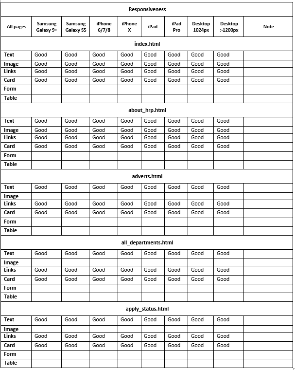
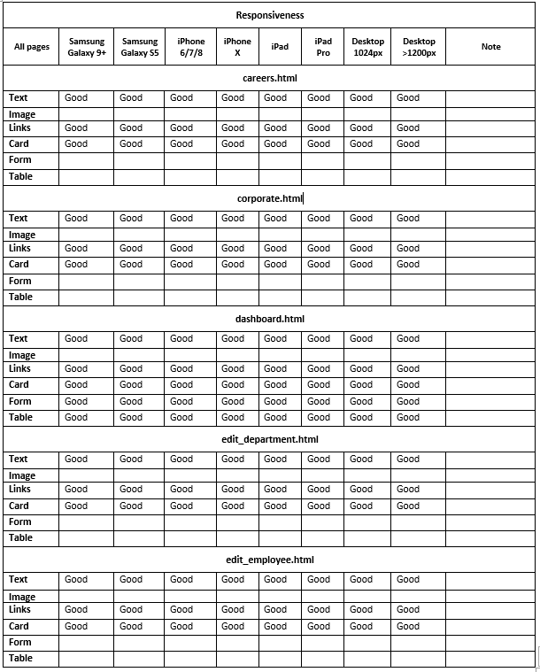
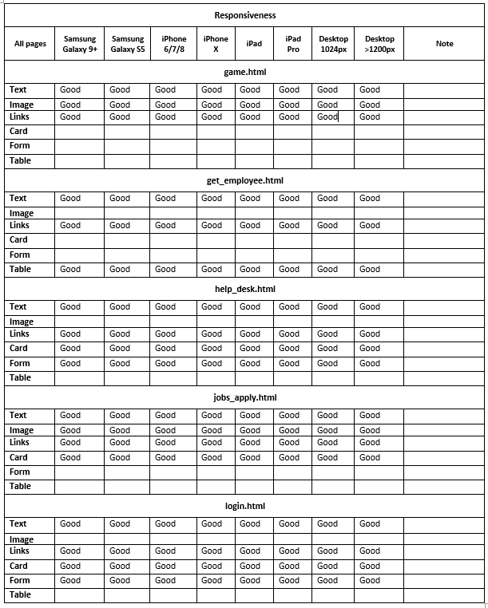
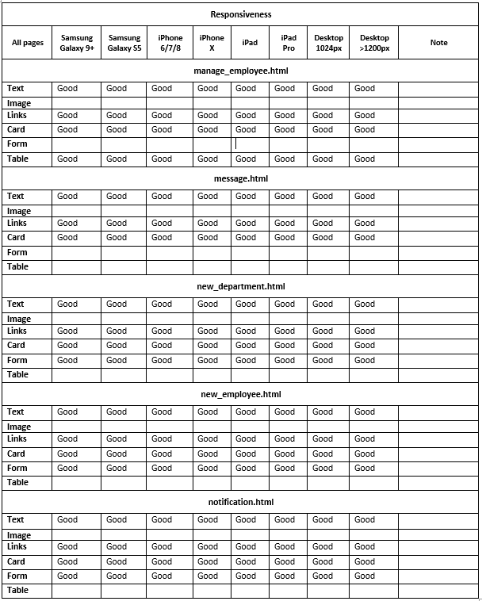
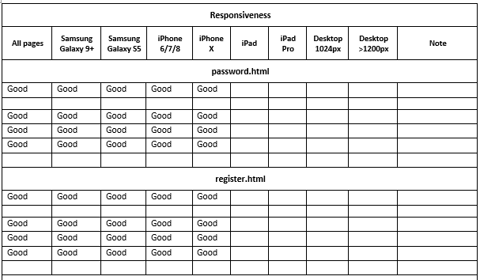
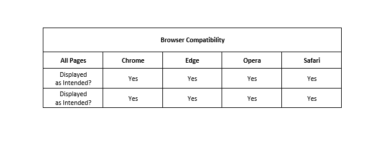

## 1.0 Project Name: Human Resource Portal (HRP)
The aim of the project is to develop a custom application for Human Resource management of a company. The borrowed name of the company used in this case project is called MDB. 
The application consists of a home page for public users. The home page has a header bar, navigation bar, static image of employees in a meeting, a Self-service center for job seekers & employees, links to download future Android app & ios mobile app of the application, a brief note on the need for HRP and its success story, and finally a footer which also shows information about HRP and links to contact the developers.

The project is deployed to Heroku on https://fsk-hresource-portal.herokuapp.com/

## 2.0 UX
The web Application is developed for Human Resource Managers of companies to effectively store and manage their employees' data, modify their employees' information and communicate internally with their employees. They can also publish job advertisements to the public, receive job applications from prospective employees and send feedback to the applicants.

### 2.1 User stories
As Human Resource Manager (Admin/Super User), I want to:

1. create profile account for new employees which would contain their personal data.
2. enable the new employees' email addresses as their unique identifers which they can use to register on the HR Portal, so as to prevent unemployed/unauthorized persons from gaining access to Portal.
3. display individual employee's personal data and employment detail on their dashboard, accessible to them after they login
4. create new departments and modify existing departments in the company so as to group employees into appropriate departments based on their job roles and duties
5. view all employees list in a tabular form showing detail about their names, departments, date of employment, gender among others
6. send notice to all current employees accessible directly on their dashboard
7. receive comments, complains and feedback from all current employees in my Inbox
8. reply to the employees' messages or delete the messages if necessary
8. reply to employees' messages or delete the messages where necessary
9. modify and update indvidual employee's records or data existing in the company's database
10. delete employees' records and terminate their contract with the company
11. advertise new job vacancies to the public, receive applications online and send update to applicants
12. contact the developers' agent for technical support in case of any issue arising while using the application

As a current employee, I want to:
1. register on the HR Portal with my email successfully
2. login into the Portal with my email and password successfully
3. view my dashboard to see my personal data as it is in the company's record
4. read notifications sent to all employees by the HR manager
5. send my comments, complains and feedback to the HR office
6. receive response to my comments and complains from HR office
7. change my password at my own will
8. contact the developers' agent for Technical support such as in case I forget my password or for any other assistance
9. download mobile apps versions of the HR Portal if necessary

As a public user, I want to:
1. read brief information about the HR Portal
2. contact the developers in case I need to get the software for my own company's HR department
3. view exisitng career opportunities in the company, check current job vacancies, if any
4. apply for job online, in case there is vacancy, and get update from HR office in regard to my application
5. follow and connect to the company through their social media platforms 

### 2.2 Wireframes
In order to bring the idea of this project to life, wireframes were produced with the use of Figma. The folder named "wireframes" has been uploaded in this project's GitHub repository. The folder contains images of the wireframes designed to show Desktop, Tablet and Mobile views of various pages of the application

## 3.0 Features
### 3.1 Existing Features
1. This Web application basically consists of about twenty-three pages which are fundamentally html files or templates

2. It consists of a top bar designed for Home page only. The top bar displays the project name and social media links by which users can connect to the company using the web application.

3. It also consists of a main navigation bar (navbar) that displays company's logo and menu items. This navigation bar is displayed across all pages of the application. Since there are three levels or categories of users, the menu items on this navbar are specifically selected to meet the needs of each user category. Public users can only view Home, Website, Register and Sign in menu links while registered employees who are logged in can view Home, Corporate and Profile menu links which has two submenu links named Dashboard and Logout. The highest level of user (Admin or HR manager) can view three additional menu links restricted to their official roles. The menu links are Internal Memo which comprises of Inbox & Notification submenu links, Operations which comprises of New Department & All Departments submenu links, and Employees which comprises of New Employees, Employee Directory & Manage Employees submenu links. 

4. It has a Home page particularly designed for public users and job seekers in mind. At the right side of the Home page is Self Service center where job seekers can expect to see existing vacancies as published by the Company's HR office. They can also apply for job through the Job Application link, check their job application status and get help from the Support team. If there are job vacancies, the HR office would update the Self Service section as needed. However, as at the time of developing this project, it was assumed that no vacancies existed yet due to the residual impact of COVID-19 pandemic. SO those links are working but no useful content in the pages since no vacancies existed. Job seekers could check again in future.

5. On the top left of the Home page is a static image of employees, happy on their jobs and holding a meeting. 

6. Also on the Home page, there are links to download ios & android mobile apps of this application in future. Although, there are no mobie apps available right now, but this is done in anticipation and as a way to improve use experience in future, such that employees can access their Portal anywhere and at anytime they wish, with the use of their mobile devices.  

6. Moreover, the Home page has three image links which allow current employees to login, contact Help Desk in case they forgot their passwords or username(email).

7. Coupled with the above, the Home page consists of a brief note about the application and its success story.

8. At the Home page footer section, there is brief information about the HR Portal and a link to read more about the application. The idea here was that those information can serve as advertisements for public users to consider using the software in managing their company's Human Resources. Public users could also contact to the developers and technical support team from the links provided at the footer section. 

7. The Home page footer section also consists of Quick links to navigate some important pages in the application.

8. It consists of a Register page which allows employees to register after the HR manager has created their profiles in the company's database records. The employees are required to use the same email address submitted to the HR office at their employment confirmation. The HR manager uses their email to create their profile by filling the form on New Employee page. No persons or individuals are allowed to register on the Portal without being duly documented by the HR manager, as bonafide employees of the company.

9. After successful registration, each employee can login to the HR Portal using their registered email and password created. For the purpose of granting access to Code Instistute's Project Assessment Team, the following login credentials are provided for them to login as Super/Admin user and have the HR manager's previledges. 

                   Email: admin@hrportal.com
                   Password: 1230master

10. The Login page consists of links to return to Home page and another link to navigate to Register page for new employees

11. After successful login, employees get to their dashboard where they can view a welcome message, detail of their records with the company, their assigned duties and Attendance record. The following login detail is provided for Project Assessment team to test the application as a registered employee

                    Email: employee@hrportal.com
                    Password: 1230user

12. Also On the dashboard, there are links provided for employees to change their password, read industrial articles online and to contact Help Desk for support in case they encounter any issue while using the Portal.

13. Moreover, on the dashboard, there is a Complain form by which employees can send their complains, request or feedback to the HR Office directly. There is also a section on the dashboard where all employees can receive and read notifications sent from HR office. The latest notification is displayed in the space provided.

14. The Corporate page consists of general information to all employees about the company's Code of Conduct and Company Policy

15. Messages sent by employees to HR office are collected and viewable on Inbox page while the HR officer/manager can send general notice/message to all employees through the form provided on Notification page. Each message consists of two links for reply and delete. Reply can only be sent to the email of the sender. Both Inbox page and Notification page are accessible through Internal Memo menu link on the navbar. 

16. HR manager can create new departments through the form on New Department page while all existing departments in the company are accessible on All Departments page. On each department, there are two links for ediiting and deleting the department. Links to New Department and All Departments are accessible through Operations menu item on the navbar.

17. Furthermore, through Employees menu link, the HR manager can create profile for new employees through form available on New Employee page. Employees Directory page consists of a table that displays the list of all employess in the company. The list can be filtered by individual employee's name, department, email address or gender through a Live search bar on top of the table of employees. Manage Employees also consists of list of all employees grouped or categorized by their respective departments. An accordion is used for each department where each employee's record consists of two buttons; one for editing the employee's detail and the other button for deleting or terminating the employee from the company, an indication of firing or final dismisal. It also consists of a Search to filter Departments by name.

18. A click on the Logout link, accessible through Profile menu link, would log out user and end their current session.

19. A click on the company's logo or the application's name on both top navigation bars would return all users to the Home page.

20. The application has an interactive alert fucntionality that pops up on the browser window when a user clicks on delete button. This functionality is a way to confirm that the user knows what he is doing in case they accidentally click on the delete button.

21. The search bar to filter Department by name on Manage employees page is hidden in mobile view

22. Finally the application is equiped with capabilty to communicate to user through flash messages to show them the last major action they just performed on the application. The flash message has an icon X that can be used to remove flash message from screen.

### 3.2 Features Left to Implement
1. To increase the capability of this application which would allow employees to be able to change their passwords without contacting Support team, in case they can't login to the portal as a result of forgotten password. They would be able to change their password or create new password through the link Password Reset button on Home page that would be sent to their individual's email address.
2. Live counting of projects and customers with update on customer review to replace the static information on HR Portal Success story on Home page.
3. Links to download or revise Employees Code of conduct and the Company policy to be included on the Corporate page.
4. Each employee's attendance record available on their dashboard to be connected to the company's Clock in device that monitores employees' attendance
5. Record of each employee's payroll and account information to be included in thier respective profile
6. To programmatically enable the checkbox on the Contact form which would allow sending of a copy of the message sent to be delievered into sender's email address
7. The Search bar for departments, in manage_employee page, is not shown in small & medium devices. I hope to fix that in future.
8. To add text editor and editing functionalities such as Bold, Underline and others, in the notification form and complaint form on Notification page and Dashboard page respectively.
9. The space left in the Self Service section of the Home page is meant to accomodate addional buttons and links in future expansion of the application
 
### 3.3 Languages and Technologies Used
1. <a href="https://en.wikipedia.org/wiki/HTML" target="_blank">HTML5:</a>  This project uses HTML5 as the backbone and main markup language.
2. <a href="https://mdbootstrap.com/docs/b4/jquery/" target="_blank">Material Design:</a> It uses Material Design for Bootstrap 4 Standard as Frontend Framework to design its layout and user interface.
2. <a href="https://en.wikipedia.org/wiki/CSS" target="_blank">CSS3:</a> The project uses CSS3 for additional styling.
4. <a href="https://ianlunn.github.io/Hover/" target="_blank">Hover.CSS:</a> It uses Hover.css for button hover.
5. <a href="https://fontawesome.com/" target="_blank">Font Awesome:</a> It uses Font Awesome for form input fields and button icons.
6. <a href="https://www.javascript.com/" target="_blank">JavaScript:</a> It uses vanilla JavaScript for flash message close icon and cursor focus in Live search bar.
7. <a href="https://flask.palletsprojects.com/en/2.0.x/" target="_blank">Flask:</a>  It uses Flask microframework based on Python Language to write about 500 lines of server code that provide dynamic content, CRUD Operations with data, user authentication and other programming functionalities.
8. <a href="https://www.mongodb.com/" target="_blank">MongoDB:</a> It uses MongoDB, a Nosql database which stores user data in various collections. The data is manipulated programmatically through CRUD operations.
9. <a href="https://heroku.com" target="_blank">Heroku:</a> It uses Heorku platform as a Service for deployment to make the application visible and available for the public

## 4.0 Testing
All the internal and external links including menu items on navigation bar works well and the application looks good on Chrome, Mozilla and Edge browsers. The site is responsive on mobile devices.

### 4.1 Code Validation
1. HTML codes were tested with <a href="https://validator.w3.org/#validate_by_input" target="_blank">W3C MarkUp Validation Service</a>. The codes returned with no error.
2. CSS codes were tested with <a href="https://jigsaw.w3.org/css-validator/" target="_blank">W3C CSS Validation Service</a>. The codes returned with no error.
3. JavaScript codes were tested with <a href="https://jshint.com/" target="_blank">JSHint</a>. The codes returned with no error.
4. Python codes were tested with <a href="http://pep8online.com/" target="_blank">PEP8</a>. The codes returned with no error.

### 4.2 Testing Responsiveness
1. All the pages of this application are well responsive on all devices including dektop, tablet and mobile devices. See images below for results.

2. In addition, this application's responsiveness was also tested on this site http://ami.responsivedesign.is/#

### 4.3 Testing Browser Compatibility
This application is compatible on popular browsers including Chrome, Edge, Safari and Firefox.
 

### 4.4 Testing User Story 
The following user stories for Human Resource Manager (Admin/Super User) were tested and found to be working as expected. Based on results of the testing, Human Resource Manager is able to:
1. create profile account for new employees which would contain their personal data.
2. enable the new employees' email addresses as their unique identifers which they can use to register on the HR Portal, so as to prevent unemployed/unauthorized persons from gaining access to Portal.
3. display individual employee's personal data and employment detail on their dashboard, accessible to them after they login
4. create new departments and modify existing departments in the company so as to group employees into appropriate departments based on their job roles and duties
5. view all employees list in a tabular form showing detail about their names, departments, date of employment, gender among others
6. send notice to all current employees accessible directly on their dashboard
7. receive comments, complains and feedback from all current employees
8. reply to employees' messages or delete the messages where necessary
9. modify and update indvidual employee's records or data existing in the company's database
10. delete employees' records and terminate their contract with the company
11. advertise new job vacancies to the public, receive applications online and send update to applicants
12. contact the developers' agent for technical support in case of any issue arising while using the application

The following user stories for employee were tested and found to be working as expected. Based on results of the testing, an employee is able to:
1. register on the HR Portal with their email successfully
2. login into the Portal with my email and password successfully
3. view my dashboard to see my personal data as it is in the company's record
4. read notifications sent to all employees by the HR manager
5. send their comments, complains and feedback to the HR office
6. receive response to their comments and complains from HR office
7. change their password at their own will
8. contact the developers' agent for Technical support such as in case they forget password or for any other assistance
9. download mobile apps versions of the HR Portal when necessary

The following user stories for public user were tested and found to be working as expected. Based on results of the testing, public user is able to:
1. read brief information about the HR Portal
2. contact the developers in case they need to get the software for their own company's HR department
3. view exisitng career opportunities in the company, check current job vacancies, if any
4. apply for job online, in case there is vacancy, and get update from HR office in regard to my application
5. follow and connect to the company through their social media platforms 

### 4.5 Testing Existing Features
1. All the navigation links and buttons on the application work as expected
2. Human Resource manager can create employee's record into the database. 
3. He can also read, update and delete their records successfully and these complete CRUD functionalities.
4. All the forms including Register form, Login form and all other forms work as expected.
5. Registered users can change their passwords successfully after they login
6. Public users can view all the pages in Self Service center to check for job vacancies
7. Users can read more detail about the application and they can contact the developers
8. Users can contact Support team in case they encounter any technical issue while using the application
9. Employees can send message to HR office through the Complain form on their dashboard
10. Humnan Resource manager can send notifications to employees through the notification page
11. Employees can read the most recent notification from the HR office through the accordion on their dashboard
12. All the links on the Home page footer and inner pages are working as expected

### 4.6 Bugs
While developing this application, I encountered some bugs and fixed them as follow:
1. The two cards on dashboard template did not initially display well in mobile view. I fixed this bug by using a container-fluid on the page to replace the container I used earlier. I also wrapped each card inside a container and that took care of the display in mobile view since cards are responsive by their core nature.

2. I intended to display the current notification from HR office in the employee's dashboard but It was nasty to see that all notifications from the database were displaying and the whole stuff was messed up. So I sorted the notifications using indexing method to pick only the last notification.

3. I set width manually for the row that contained cards used in register and login templates. This width created an extra white space at the top right hand of the navigation bar which made to require scrolling to the right tobe able to view the whole navigation bar. I observed the navigation itself was responsive in mobile but the white space would shoew when I put the register and login cards. So I fixed this bug by removing the width I set manually on the row that contined the cards.

4. When I thought to have finished the project, I changed debug=True to debug=False in my server file. I observed later that few changes I was making won't just show in my project after hard-reloading and refreshing my browser. I fixed this bug by reverting back to debug=True. However, I didn't forget to change it back to False before I finally submitted the project.

## 5.0 Deployment
This project is hosted on Heroku using this procedure:
1. I first set up some important files (requiremnts.txt & Procfile) that Heroku needs to run the App 
2. At the terminal, I typed pip3 freeze --local > requirements.txt (this file is required to tell Heroku which apps & dependencies are required to runn the App)
3. I typed echo web: python app.py > Procfile (this file is what helps Heroku to know which file runs the App and how to run it)
4. I login to heroku, clicked New, Create new app 
5. I chose GitHub option in order to set up Automatic Deployment from my Repository
6. I typed & searched the name of my App Repo in space provided and clicked Connect
7. I clicked on Settings Tab, then clicked on Reveal Config Vars - this is where to securely tell Heroku those required hidden variables
8. I opened env.py, type all the 5 default environment variables with their values, as they are, but without quotations
9. I clicked Hide Config Vars, then returned to Deploy Tab
10. Before Deploy, I returned to my App project, at the Git command Terminal, typeed Git status to see any untracked files/pending changes 
11. I added requiremnts.txt file and Procfile one by one and push them to GitHub separately
12. I returned to Heroku and clicked Enable Automatic Deploys
13. I clicked Deploy Branch, after install complete - I saw the App was successfully deployed to Heroku

## 6.0 Credits
### 6.1 Content
1. The MDB logo used in this project was obtained from <a href="https://mdbootstrap.com/docs/b4/jquery/">MD Bootstrap</a> 
2. The code used to design the project's User Interface was copied from <a href="https://mdbootstrap.com/docs/b4/jquery/">MD Bootstrap</a> 

### 6.2 Media
The images used in the Home page of this web application were obtained from <a href="images.google.com">Google images</a>

### 6.3 Acknowledgement
The inspiration for this project was my personal innovative idea
